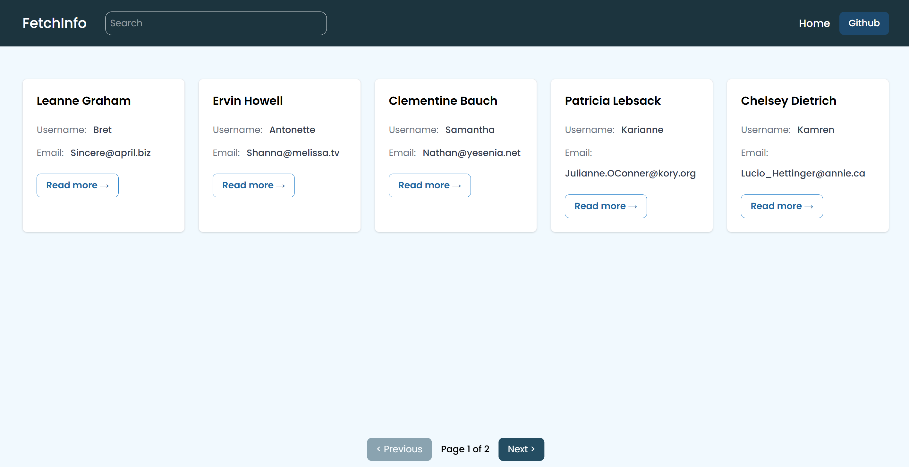
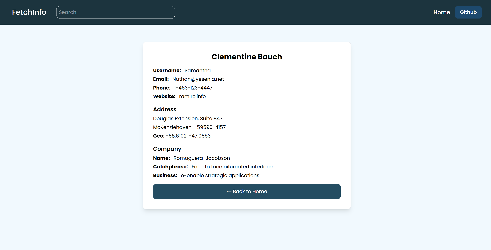

# 🚀 FetchInfo

## 🌟 Overview
**FetchInfo** is a React.js application that fetches and displays data from a public API. The application allows users to search and filter the displayed data.

🔗 **Live Demo:** [FetchInfo](https://fetchinfo.netlify.app)

---

## ⚡ Features
✔️ Responsive Design  
✔️ Smooth Animations & Transitions  
✔️ Interactive UI Elements  

---

## 🛠 Tech Stack
- **Frontend:** React, Tailwind CSS  
- **API:** JSONPlaceholder  

---

## 📸 Screenshots

### 🏠 Homepage

### 🔍 user details

